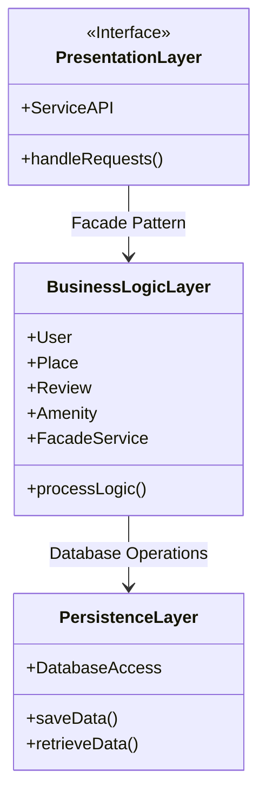

```mermaid
classDiagram
    class PresentationLayer {
        <<Interface>>
        +ServiceAPI
        +handleRequests()
    }

    class BusinessLogicLayer {
        +User
        +Place
        +Review
        +Amenity
        +FacadeService
        +processLogic()
    }

    class PersistenceLayer {
        +DatabaseAccess
        +saveData()
        +retrieveData()
    }

    PresentationLayer --> BusinessLogicLayer : Facade Pattern
    BusinessLogicLayer --> PersistenceLayer : Database Operations
```
