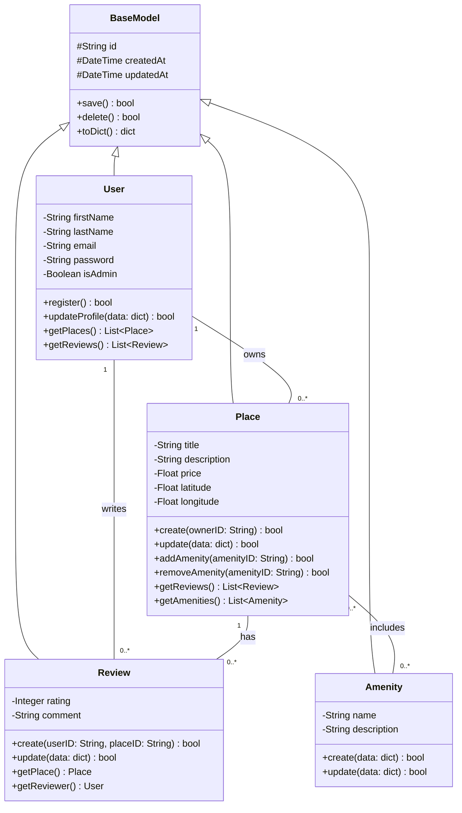

# HBnB Evolution - Business Logic Layer Class Diagram

```mermaid
classDiagram
    class BaseModel {
        #String id
        #DateTime createdAt
        #DateTime updatedAt
        +save() bool
        +delete() bool
        +toDict() dict
    }

    class User {
        -String firstName
        -String lastName
        -String email
        -String password
        -Boolean isAdmin
        +register() bool
        +updateProfile(data: dict) bool
        +getPlaces() List~Place~
        +getReviews() List~Review~
    }

    class Place {
        -String title
        -String description
        -Float price
        -Float latitude
        -Float longitude
        +create(ownerID: String) bool
        +update(data: dict) bool
        +addAmenity(amenityID: String) bool
        +removeAmenity(amenityID: String) bool
        +getReviews() List~Review~
        +getAmenities() List~Amenity~
    }

    class Review {
        -Integer rating
        -String comment
        +create(userID: String, placeID: String) bool
        +update(data: dict) bool
        +getPlace() Place
        +getReviewer() User
    }

    class Amenity {
        -String name
        -String description
        +create(data: dict) bool
        +update(data: dict) bool
    }

    %% Inheritance relationships
    BaseModel <|-- User
    BaseModel <|-- Place
    BaseModel <|-- Review
    BaseModel <|-- Amenity

    %% Association relationships
    User "1" -- "0..*" Place : owns
    User "1" -- "0..*" Review : writes
    Place "1" -- "0..*" Review : has
    Place "0..*" -- "0..*" Amenity : includes
```
