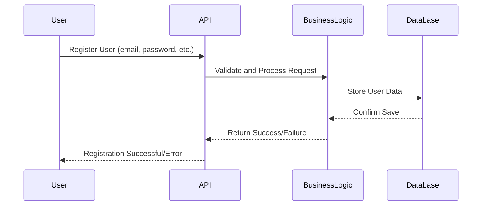
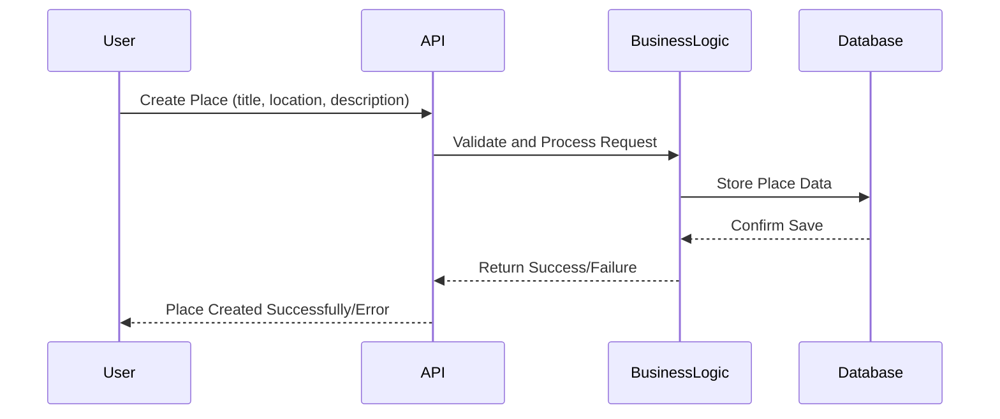
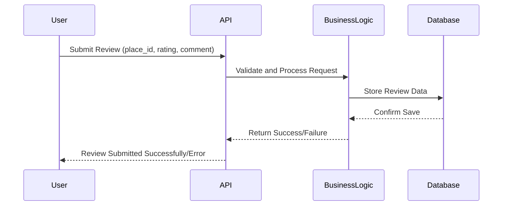
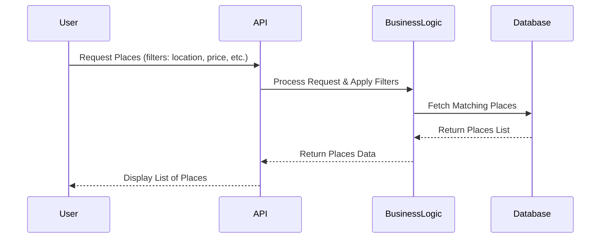

# Sequence Diagrams for API Calls

## Objective
The following sequence diagrams illustrate the interaction between the different layers (Presentation, Business Logic, and Persistence) in the HBnB application for handling various API calls.

## API Calls
### 1. User Registration

**Explanation:**
- The user sends a registration request to the API.
- The API forwards the request to the business logic for validation and processing.
- The business logic interacts with the database to save user details.
- Once saved, a response is returned to the API, which sends a final response to the user.

### 2. Place Creation

**Explanation:**
- The user submits a request to create a place.
- The API routes the request to business logic for validation.
- The data is stored in the database, and a confirmation is returned.
- The API then responds to the user with the outcome.

### 3. Review Submission

**Explanation:**
- The user submits a review for a specific place.
- The API processes the request via the business logic layer.
- The review is stored in the database, and the process concludes with a response to the user.

### 4. Fetching a List of Places

**Explanation:**
- The user requests a list of places based on filters.
- The API forwards the request to business logic, which queries the database.
- The filtered results are returned through the API to the user.
